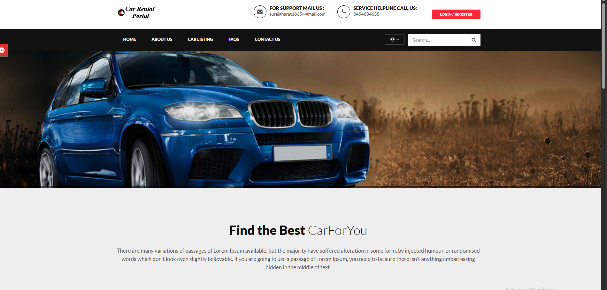
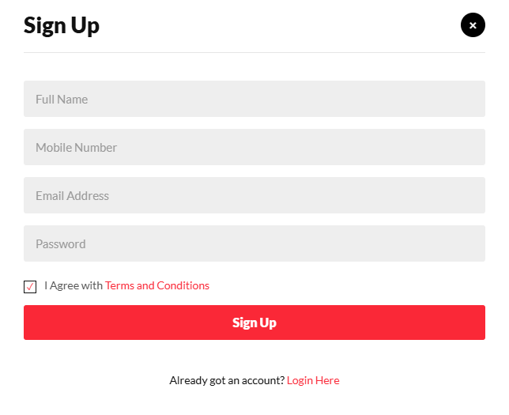

# 🚗 Car Rental Management System  
A complete web-based Car Rental Management System built using **PHP**, **MySQL**, **HTML**, **CSS**, and **JavaScript**.  
This system allows users to browse, book, and manage car rentals while providing an admin interface to manage vehicles, bookings, testimonials, and users.

---

## 📸 Screenshots

### 🏠 Home Page

### 🚘 Car Listings

### 📄 Car Details & Booking

### 📑 User Booking Details

### 📝 Sign Up Page

---

## 🚀 Features

### 👤 User Features
- User registration and login  
- View available cars  
- Car details with images  
- Online booking system  
- Manage bookings  
- Update profile and change password  
- Post and view testimonials  

### 🛠️ Admin Features
- Login & logout  
- Add, update, delete cars  
- Manage car brands  
- Manage bookings  
- Manage customers  
- View testimonials  
- Dashboard & statistics  

---

## 🛠️ Tech Stack
- **Frontend:** HTML, CSS, JavaScript, Bootstrap  
- **Backend:** PHP  
- **Database:** MySQL  
- **Server:** Apache (XAMPP)

---

## 📂 Folder Structure

